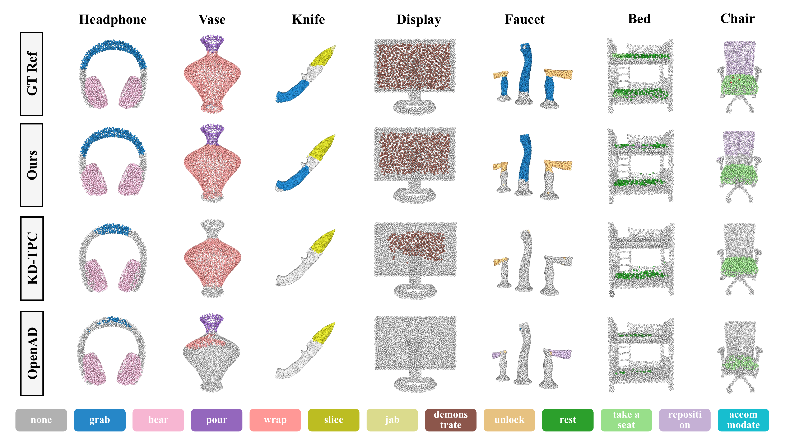
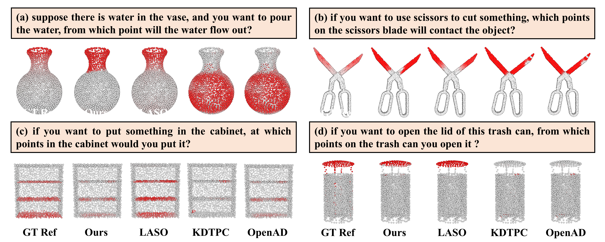

# Open-Vocabulary 3D Affordance Understanding with Functional Text Enhancement

## Abstract
3D affordance understanding is crucial for robots interacting with real-world environments, including tasks such as manipulation, navigation, and human-robot collaboration. Existing methods enable open vocabulary queries typically through label-based language descriptions, but they often suffer from under-generalization and insufficient discrimination in their representations. To address these limitations, we first introduce functional text enhancement to enrich affordance semantics, then devise a dual encoder to extract embeddings for point clouds and descriptions. Additionally, we propose a novel multi-level representation alignment framework, incorporating a supervised contrastive loss to strengthen the correspondence between these embeddings. Our solution significantly improves the understanding of affordance complexity in 3D scenes, and the learned representations are highly adaptable to various types of affordance text queries especially in the zero-shot setting. Extensive experiments demonstrate the effectiveness of the proposed method.

## Dependencies
```python
pip install -r requirements.txt
```
## Datasets
- Training and Label-as-Query zero-shot Testing: https://openad2023.github.io/
- Question-as-Query zero-shot Testing: https://github.com/yl3800/laso

## Evaluation
```python
python main.py
```
## Visualization
- Label-as-Affordance-Query

- Quesntion-as-Affordance-Query



